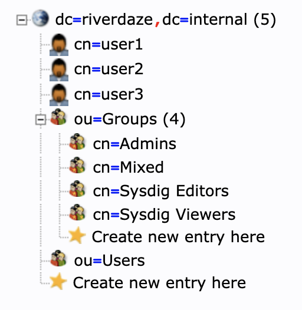

# Description

This builds a Docker image based off of [osixia/docker-openldap](https://github.com/osixia/docker-openldap) with data populated.  This data that is populated has a main use case for testing Sysdig LDAP Integration.

# Build

```bash
docker build -t my_ldap_image .
```

# Run Locally

This will start the image along with phpLDAPAdmin as well on your local machine so you can login and make changes.

```bash
docker-compose up -d
```

### phpLDAPAdmin
[http://127.0.0.1:8090/](http://127.0.0.1:8090/)

# OOTB Configuration

*baseDN:* dc=riverdaze,dc=internal

### Users

* admin / admin
* user1 / user1_pass
* user2 / user2_pass
* user3 / user3_pass

### Groups

* Admins
* Mixed
* Sysdig Editors
* Sysdig Viewers



# Version

1.0 - Initial

# References

* [phpLDAPAdmin](https://github.com/osixia/docker-phpLDAPadmin)
* [osixia/docker-openldap](https://github.com/osixia/docker-openldap)